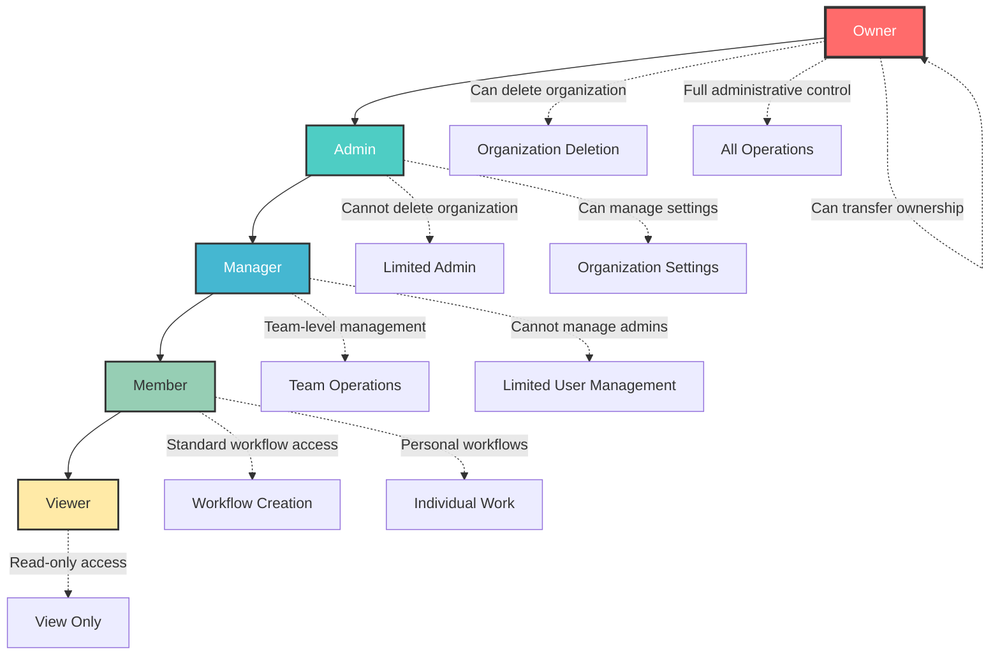
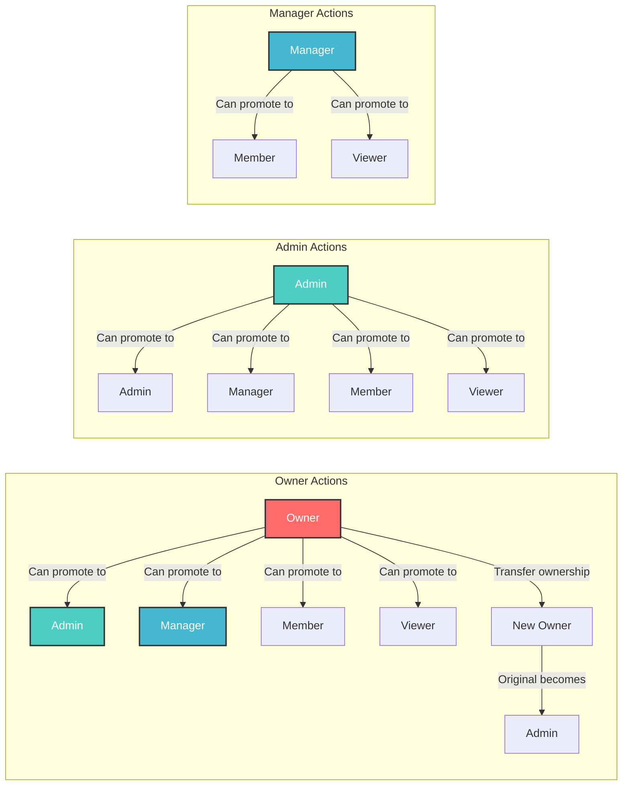
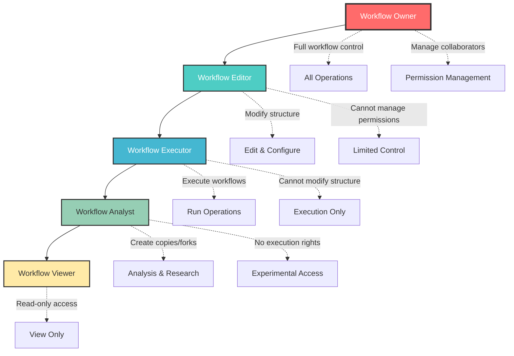
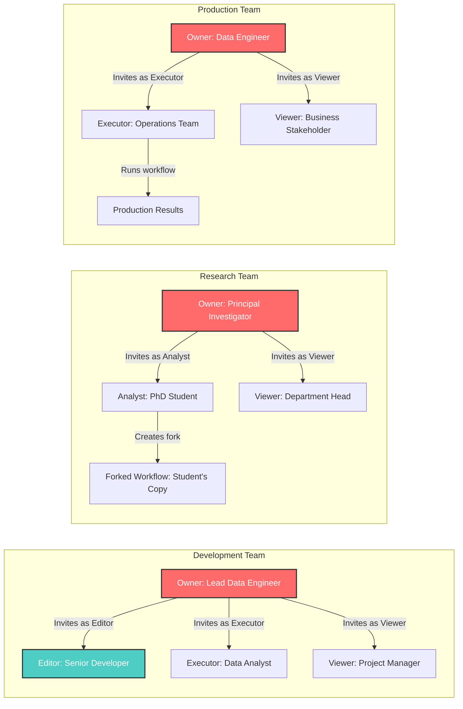
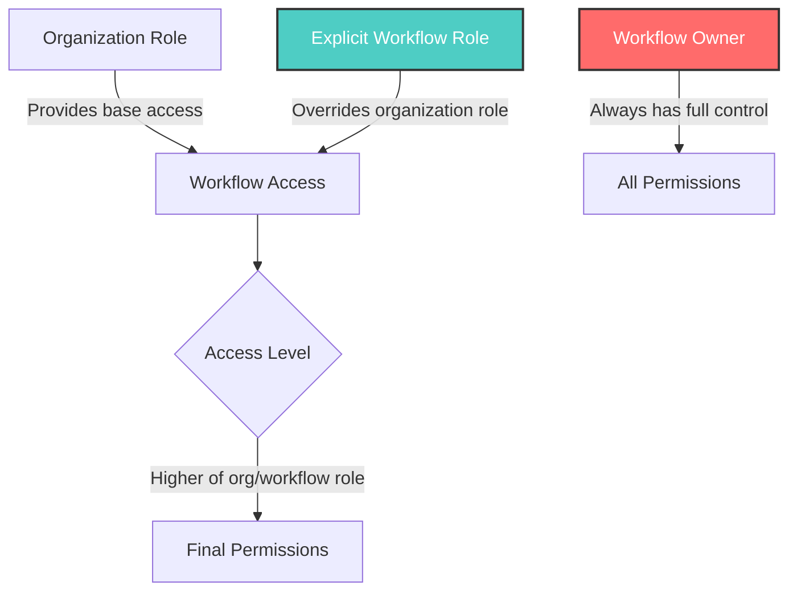

# Organization Roles and Permissions

This document describes the comprehensive role-based access control system implemented in the data workflow management platform. The system provides a hierarchical role structure that balances security, flexibility, and usability for different organizational needs.

## Role Hierarchy Overview

The platform implements a 5-tier role hierarchy where higher-level roles inherit all permissions from lower-level roles, plus additional privileges:

## Detailed Role Descriptions

### 1. 👑 **Owner** (Highest Privilege)

**Purpose**: The ultimate authority within an organization with complete control over all aspects.

**Key Characteristics**:
- Cannot be removed or have role changed by anyone
- Only one owner per organization
- Can transfer ownership to another member
- Has all privileges of Admin plus exclusive owner-only features

**Unique Permissions**:
- ✅ **Transfer Ownership**: Can transfer control to another organization member
- ✅ **Delete Organization**: Can permanently delete the entire organization
- ✅ **Irreversible Actions**: Can perform actions that cannot be undone by others

**Use Cases**:
- Organization founders
- Legal entity owners
- Final decision makers

---

### 2. 🛡️ **Admin** (Administrative Privilege)

**Purpose**: High-level administrators who can manage organization settings and all members except the owner.

**Key Characteristics**:
- Cannot delete the organization
- Cannot change or remove the owner
- Can manage all other roles (Manager, Member, Viewer)
- Has full access to organization settings

**Permissions**:
- ✅ **Manage Organization Settings**: Can modify organization details and policies
- ✅ **Invite/Remove Users**: Can add and remove members (except owner)
- ✅ **Role Management**: Can promote/demote users to Manager, Member, or Viewer roles
- ✅ **Assign Admin Role**: Can promote other users to Admin level
- ✅ **Full Workflow Access**: Can create, edit, execute, and manage all workflows
- ✅ **View All Members**: Can see complete member list and details

**Use Cases**:
- IT administrators
- Department heads
- Senior managers with broad authority

---

### 3. 🎯 **Manager** (Team Management Privilege)

**Purpose**: Mid-level managers who can handle team operations and member management within their scope.

**Key Characteristics**:
- Cannot manage Admin-level users or above
- Can invite and remove Members and Viewers
- Cannot assign Admin roles
- Focus on team-level operations

**Permissions**:
- ✅ **Team Member Management**: Can invite/remove Members and Viewers
- ✅ **Role Management**: Can promote/demote between Member and Viewer roles
- ✅ **Workflow Permissions**: Can manage workflow permissions within teams
- ✅ **View Organization Analytics**: Can access usage statistics and reports
- ✅ **Create/Edit Workflows**: Full workflow creation and editing capabilities
- ❌ **Cannot Manage Admins**: Cannot change roles of Admin-level users

**Use Cases**:
- Team leads
- Project managers
- Department supervisors
- Middle management roles

---

### 4. 👥 **Member** (Standard Access)

**Purpose**: Regular organization members with standard workflow access and creation capabilities.

**Key Characteristics**:
- Can work with workflows within the organization context
- Can create personal workflows
- Cannot manage other users
- Standard organizational participant

**Permissions**:
- ✅ **Create Workflows**: Can create new workflows within organization
- ✅ **Edit Workflows**: Can modify workflows they have access to
- ✅ **Execute Workflows**: Can run workflows and view results
- ✅ **Download Results**: Can download workflow outputs
- ✅ **Collaboration**: Can collaborate on shared workflows
- ✅ **Personal Workspace**: Can maintain individual workflow space
- ❌ **No User Management**: Cannot invite, remove, or change user roles

**Use Cases**:
- Data scientists
- Data engineers
- Analysts
- Regular contributors
- Individual contributors

---

### 5. 👁️ **Viewer** (Read-Only Access)

**Purpose**: Stakeholders who need visibility into organizational workflows without modification capabilities.

**Key Characteristics**:
- Complete read-only access
- Cannot create or modify any workflows
- Cannot perform any management functions
- Ideal for oversight and audit purposes

**Permissions**:
- ✅ **View Workflows**: Can see workflow designs and structures
- ✅ **View Results**: Can access workflow execution results
- ✅ **Download Results**: Can download outputs for analysis
- ✅ **Browse Organization**: Can explore organizational workflow library
- ❌ **No Creation**: Cannot create new workflows
- ❌ **No Modification**: Cannot edit existing workflows
- ❌ **No Execution**: Cannot run workflows
- ❌ **No Management**: No user or organizational management capabilities

**Use Cases**:
- Stakeholders
- Auditors
- Compliance officers
- External reviewers
- Read-only consultants
- Board members

## Permission Matrix

| Permission | Owner | Admin | Manager | Member | Viewer |
|------------|-------|-------|---------|--------|--------|
| Delete Organization | ✅ | ❌ | ❌ | ❌ | ❌ |
| Transfer Ownership | ✅ | ❌ | ❌ | ❌ | ❌ |
| Manage Organization Settings | ✅ | ✅ | ❌ | ❌ | ❌ |
| Invite/Remove Admins | ✅ | ✅ | ❌ | ❌ | ❌ |
| Invite/Remove Managers | ✅ | ✅ | ❌ | ❌ | ❌ |
| Invite/Remove Members | ✅ | ✅ | ✅ | ❌ | ❌ |
| Invite/Remove Viewers | ✅ | ✅ | ✅ | ❌ | ❌ |
| Assign Admin Role | ✅ | ✅ | ❌ | ❌ | ❌ |
| Manage Workflow Permissions | ✅ | ✅ | ✅ | ❌ | ❌ |
| Create Workflows | ✅ | ✅ | ✅ | ✅ | ❌ |
| Edit Workflows | ✅ | ✅ | ✅ | ✅ | ❌ |
| Execute Workflows | ✅ | ✅ | ✅ | ✅ | ❌ |
| View Workflows | ✅ | ✅ | ✅ | ✅ | ✅ |
| Download Results | ✅ | ✅ | ✅ | ✅ | ✅ |
| View Organization Analytics | ✅ | ✅ | ✅ | ❌ | ❌ |

## Role Transition Rules

### Promotion Rules
- Users can only be promoted by someone with higher privileges
- Cannot assign roles equal to or higher than your own
- Owners and Admins can assign any role below theirs
- Managers can only promote to Member or Viewer roles

### Protection Rules
- **Owner Protection**: Owner cannot be removed or demoted by anyone
- **Self-Protection**: Users cannot change their own roles
- **Hierarchy Respect**: Cannot manage users with equal or higher privileges
- **Ownership Transfer**: Only owners can transfer ownership, and they become Admin after transfer

### Special Transitions

## Implementation Notes

### Security Considerations
- All role changes are logged and auditable
- Permission checks are enforced at both API and UI levels
- Role hierarchy prevents privilege escalation attacks
- Owner role provides ultimate recovery mechanism

### Migration Strategy
- Existing admin users are automatically promoted to Owner role for organizations they created
- Other existing members retain their current access levels
- Database migration ensures data consistency during transition

### Best Practices
1. **Principle of Least Privilege**: Assign the minimum role necessary for user functions
2. **Regular Review**: Periodically review and adjust user roles
3. **Clear Communication**: Ensure users understand their role capabilities
4. **Backup Ownership**: Consider having multiple Admins as backup to Owner
5. **Documentation**: Maintain records of role assignments and changes

## API Endpoints

### Role Management Endpoints
- `GET /api/organizations/{org_id}/role` - Get current user's role
- `PUT /api/organizations/{org_id}/members/{user_id}/role` - Update user role
- `POST /api/organizations/{org_id}/transfer-ownership` - Transfer ownership
- `GET /api/organizations/{org_id}/members` - List members (requires management privileges)

### Permission Dependencies
- `require_organization_owner` - Owner-only operations
- `require_organization_admin` - Admin+ operations  
- `require_member_management_permission` - Manager+ operations
- `require_organization_member` - Member+ operations

This role system provides a robust foundation for organizational governance while maintaining flexibility for various use cases and organizational structures.

---

# Workflow-Specific Roles and Permissions

In addition to organization-level roles, the platform implements a granular workflow-specific permission system that allows fine-grained control over individual data pipelines and workflows.

## Workflow Role Hierarchy Overview

The workflow permission system operates independently from organization roles, allowing users to have different levels of access to specific workflows based on their collaboration needs:

## Detailed Workflow Role Descriptions

### 1. 👑 **Workflow Owner** (Full Control)

**Purpose**: The creator and ultimate authority for a specific workflow with complete control over all aspects.

**Key Characteristics**:
- Original creator of the workflow
- Cannot be removed or changed by collaborators
- Only one owner per workflow
- Can transfer ownership (planned feature)

**Unique Permissions**:
- ✅ **Manage Permissions**: Can add, remove, and change collaborator roles
- ✅ **Delete Workflow**: Can permanently delete the entire workflow
- ✅ **Full Edit Access**: Can modify all aspects of workflow structure
- ✅ **Transfer Ownership**: Can transfer control to another user (planned)

**Use Cases**:
- Data pipeline creators
- Project leads responsible for specific workflows
- Research team leads

---

### 2. ✏️ **Workflow Editor** (Modification Privilege)

**Purpose**: Trusted collaborators who can modify and enhance workflow structure and configuration.

**Key Characteristics**:
- Can make structural changes to workflows
- Cannot manage other collaborators
- Full technical access except permission management
- Ideal for technical team members

**Permissions**:
- ✅ **Edit Structure**: Can modify workflow tasks, connections, and configuration
- ✅ **Execute Workflows**: Can run workflows and view results
- ✅ **Download Results**: Can access and download all workflow outputs
- ✅ **View Sensitive Data**: Can access all workflow data and configurations
- ❌ **Manage Permissions**: Cannot add/remove collaborators or change roles
- ❌ **Delete Workflow**: Cannot delete the entire workflow

**Use Cases**:
- Senior data engineers
- Technical leads
- Trusted developers
- Co-creators of workflows

---

### 3. ▶️ **Workflow Executor** (Execution Privilege)

**Purpose**: Users who can run workflows in production environments without modifying the underlying structure.

**Key Characteristics**:
- Perfect for production workflow execution
- Cannot modify workflow structure
- Can access execution results and sensitive data
- Ideal for operational team members

**Permissions**:
- ✅ **Execute Workflows**: Can trigger workflow runs with different parameters
- ✅ **Download Results**: Can access and download workflow outputs
- ✅ **View Workflow**: Can see workflow structure and configuration
- ✅ **View Sensitive Data**: Can access execution logs and data
- ❌ **Edit Structure**: Cannot modify workflow design or configuration
- ❌ **Copy Workflow**: Cannot create forks or copies

**Use Cases**:
- Production operators
- Data analysts who run existing pipelines
- Business users executing scheduled reports
- Quality assurance teams

---

### 4. 🔬 **Workflow Analyst** (Research Privilege)

**Purpose**: Research-oriented users who can study workflows and create experimental variations.

**Key Characteristics**:
- Can create copies for experimentation
- Cannot execute original workflows
- Ideal for research and development
- Perfect for learning and training purposes

**Permissions**:
- ✅ **View Workflow**: Can examine workflow structure and design
- ✅ **Download Results**: Can access historical results and outputs
- ✅ **Copy/Fork Workflow**: Can create personal copies for experimentation
- ❌ **Execute Original**: Cannot run the original workflow
- ❌ **Edit Original**: Cannot modify the original workflow
- ❌ **View Sensitive Data**: Limited access to sensitive configurations

**Use Cases**:
- Research scientists
- Data science students
- Consultants studying existing processes
- New team members learning workflows

---

### 5. 👁️ **Workflow Viewer** (Read-Only Access)

**Purpose**: Stakeholders who need visibility into workflow processes without any modification capabilities.

**Key Characteristics**:
- Complete read-only access
- Can download results for analysis
- Cannot modify, execute, or copy workflows
- Perfect for oversight and compliance

**Permissions**:
- ✅ **View Workflow**: Can see workflow design and structure
- ✅ **Download Results**: Can access workflow outputs for review
- ❌ **Execute**: Cannot run workflows
- ❌ **Edit**: Cannot modify workflow structure
- ❌ **Copy**: Cannot create forks or copies
- ❌ **View Sensitive**: Limited access to sensitive data

**Use Cases**:
- Project stakeholders
- Compliance officers
- External auditors
- Management oversight
- Documentation reviewers

## Workflow Permission Matrix

| Permission | Owner | Editor | Executor | Analyst | Viewer |
|------------|-------|--------|----------|---------|--------|
| View Workflow Structure | ✅ | ✅ | ✅ | ✅ | ✅ |
| Edit Workflow Structure | ✅ | ✅ | ❌ | ❌ | ❌ |
| Execute Workflow | ✅ | ✅ | ✅ | ❌ | ❌ |
| Download Results | ✅ | ✅ | ✅ | ✅ | ✅ |
| Copy/Fork Workflow | ✅ | ✅ | ❌ | ✅ | ❌ |
| Delete Workflow | ✅ | ❌ | ❌ | ❌ | ❌ |
| Manage Collaborators | ✅ | ❌ | ❌ | ❌ | ❌ |
| View Sensitive Data | ✅ | ✅ | ✅ | ❌ | ❌ |
| Access Execution Logs | ✅ | ✅ | ✅ | ❌ | ❌ |
| Modify Parameters | ✅ | ✅ | ✅ | ❌ | ❌ |

## Workflow Collaboration Patterns

### Common Collaboration Scenarios

### Role Assignment Best Practices

1. **Principle of Least Privilege**: Assign the minimum role necessary for user functions
2. **Production Separation**: Use Executor role for production runs to prevent accidental modifications
3. **Research Freedom**: Use Analyst role for experimental work and learning
4. **Stakeholder Visibility**: Use Viewer role for oversight without operational access
5. **Team Collaboration**: Use Editor role for trusted technical collaborators

## Integration with Organization Roles

### How Workflow and Organization Roles Interact

- **Organization Members**: Automatically get Viewer access to organization workflows
- **Organization Managers**: Can be granted elevated workflow roles by workflow owners
- **Organization Admins**: Do not automatically get workflow permissions (respects workflow owner autonomy)
- **Organization Owners**: Can view organizational workflows but cannot override workflow-specific permissions

### Permission Inheritance Rules

## API Endpoints for Workflow Permissions

### Enhanced Collaborator Management
- `GET /api/workflows/{workflow_name}/collaborators/enhanced` - List collaborators with roles
- `POST /api/workflows/{workflow_name}/collaborators/enhanced` - Add collaborator with role
- `PUT /api/workflows/{workflow_name}/collaborators/{email}/role` - Update collaborator role
- `DELETE /api/workflows/{workflow_name}/collaborators/enhanced/{email}` - Remove collaborator
- `POST /api/workflows/{workflow_name}/copy` - Create workflow fork (requires copy permission)

### Permission Checking
- All workflow operations check appropriate permissions before execution
- Role-based UI rendering in frontend components
- Granular access control for sensitive operations

## Migration from Legacy System

### Backward Compatibility
- Existing collaborators are automatically assigned **Viewer** role
- Workflow owners retain full control
- Legacy endpoints continue to function alongside enhanced system
- Gradual migration path for existing workflows

### Upgrade Path
1. **Phase 1**: Enhanced system runs alongside legacy (current)
2. **Phase 2**: UI migration to enhanced collaborator management
3. **Phase 3**: Legacy system deprecation with data migration
4. **Phase 4**: Full enhanced system deployment

This workflow-specific role system provides granular control over data pipeline access while maintaining simplicity and clarity for users. It supports diverse collaboration patterns from research environments to production operations, ensuring appropriate access levels for all stakeholders.