# System Architecture - Data Workflow Management Platform

## Overview

This is a microservices-based data workflow management platform that enables users to create, collaborate on, and execute ETL/ML pipelines through a visual drag-and-drop interface. The system is built around Apache Airflow orchestration with real-time collaboration features.

## High-Level Architecture

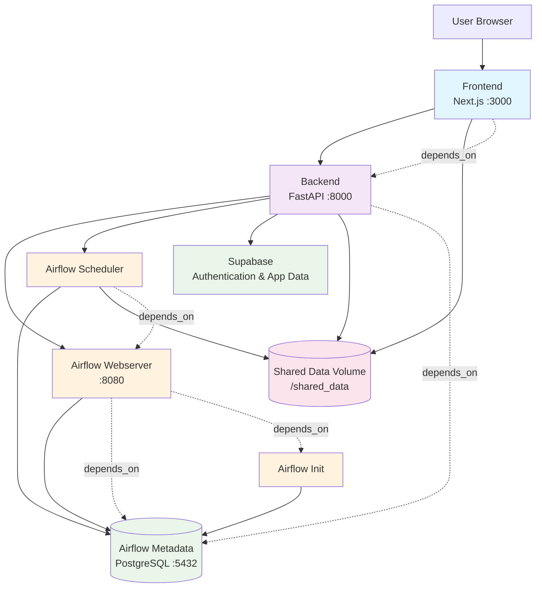

## Service Dependencies & Data Flow

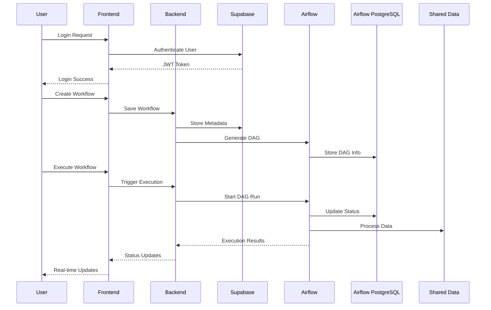

## Database Architecture

### PostgreSQL Usage Clarification

The system uses **two separate PostgreSQL instances** for different purposes:

#### 1. Airflow Metadata Database (Local PostgreSQL)
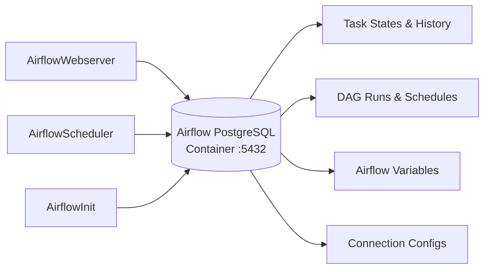

**Purpose**: Stores Airflow's internal metadata
- Task execution states and history
- DAG run information and schedules
- Airflow variables and connections
- User sessions and permissions
- Task logs and performance metrics

**Configuration**: Defined in `docker-compose.dev.yaml` as `postgres:15` container

#### 2. Supabase (Hosted PostgreSQL)
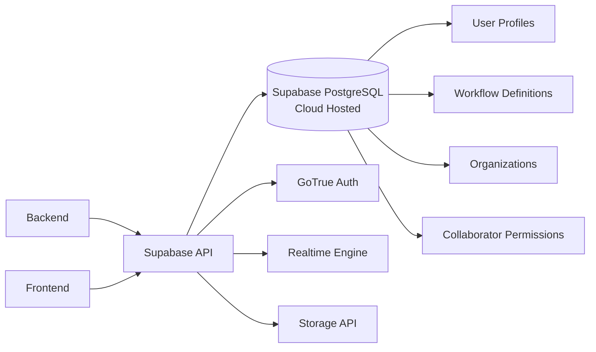

**Purpose**: Stores application data and user management
- User authentication and profiles
- Workflow definitions and metadata
- Organization and team management
- Collaboration permissions
- Real-time collaboration state

**Configuration**: Accessed via `SUPABASE_URL` and `SUPABASE_KEY` environment variables

## Component Architecture

### Frontend Components

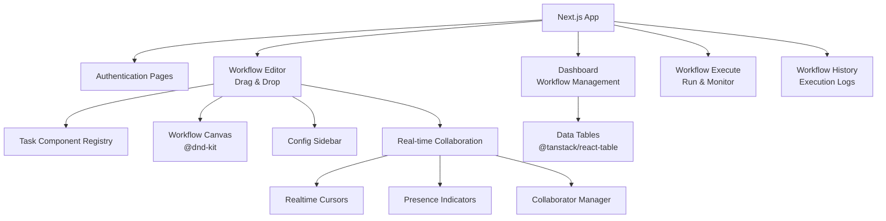

### Backend API Structure

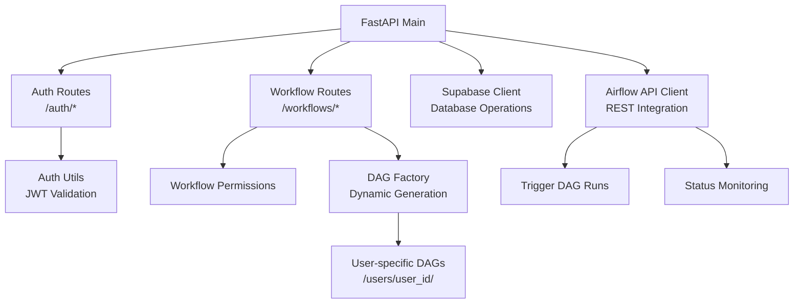

### Airflow Task Components

```mermaid
graph TD
    TaskRegistry[Task Component Registry] --> Extraction[Data Extraction]
    TaskRegistry --> Transformation[Data Transformation]
    TaskRegistry --> Loading[Data Loading]
    TaskRegistry --> Analysis[Analysis & ML]
    TaskRegistry --> Utils[Utilities]
    
    Extraction --> CSV[CSV Files]
    Extraction --> RestAPI[REST APIs]
    Extraction --> Database[Database Queries]
    Extraction --> WebScraping[Web Scraping]
    Extraction --> FTPSFTP[FTP/SFTP]
    
    Transformation --> DataCleaning[Data Cleaning]
    Transformation --> DataJoin[Data Joins]
    Transformation --> DataFilter[Data Filtering]
    Transformation --> DataPivot[Data Pivot]
    Transformation --> Cohorts[Cohort Harmonization]
    
    Loading --> FileExport[File Export]
    Loading --> PostgresLoad[PostgreSQL Loading]
    Loading --> BatchLoad[Batch Loading]
    Loading --> IncrementalLoad[Incremental Loading]
    
    Analysis --> MachineLearning[Machine Learning Pipeline]
    Analysis --> Visualization[Data Visualization]
    Analysis --> Statistics[Descriptive Statistics]
    Analysis --> Reports[Report Generation]
    
    Utils --> Notifications[Notifications]
    Utils --> CohortsUtils[Cohort Utilities]
```

## Data Flow Patterns

### Workflow Creation Flow

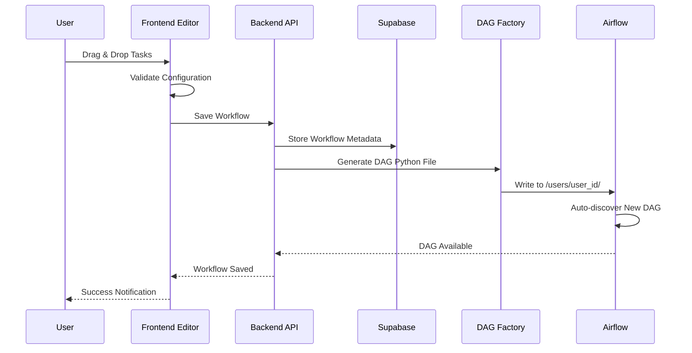

### Workflow Execution Flow

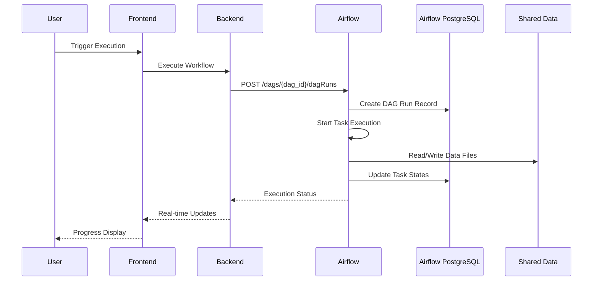

## Real-time Collaboration

### Collaboration Architecture

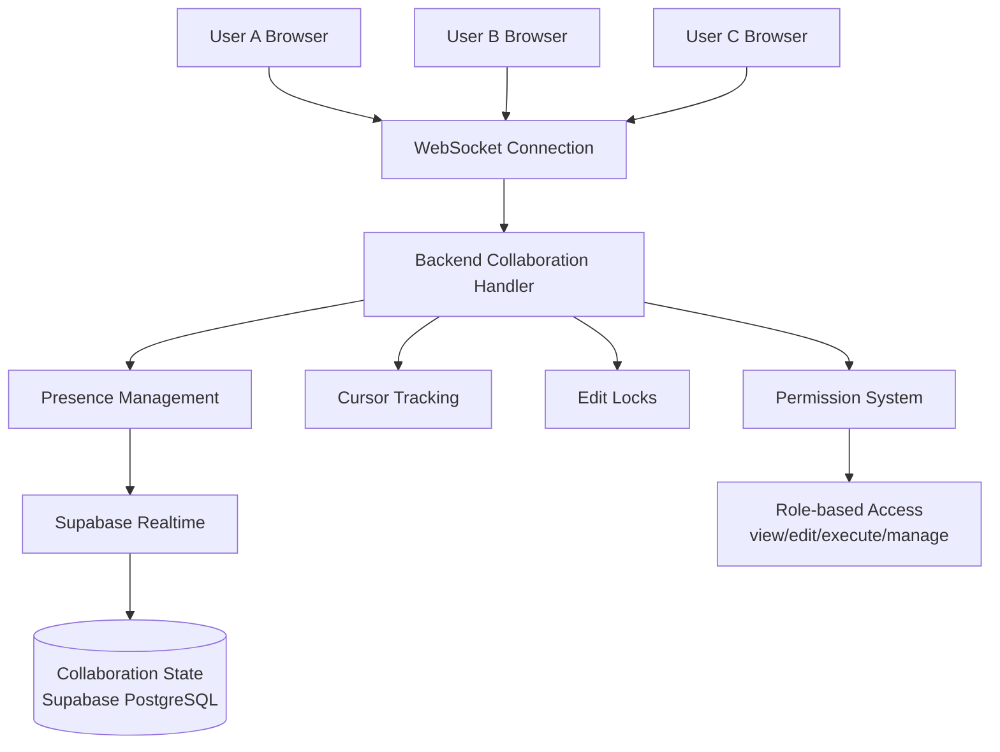

### Collaboration Features

- **Real-time Cursors**: Show other users' mouse positions using WebSocket
- **Presence Indicators**: Display active collaborators with avatars
- **Permission System**: Role-based access (view/edit/execute/manage)
- **Conflict Resolution**: Operational transformation for simultaneous edits
- **Edit Locks**: Prevent concurrent editing of same components

## Security & Isolation

### User Isolation Strategy

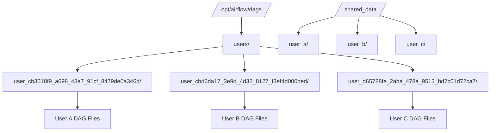

### Security Layers

1. **Authentication**: Supabase JWT tokens with configurable expiration
2. **Authorization**: Role-based permissions stored in Supabase
3. **Data Isolation**: User-specific DAG directories and data folders
4. **API Security**: Validated endpoints with proper authentication headers
5. **Container Isolation**: Docker network separation between services

## Deployment Architecture

### Development Environment

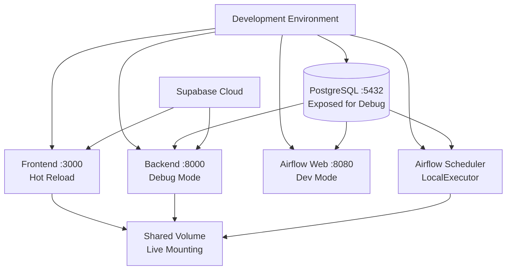

### Production Environment (without Nginx)

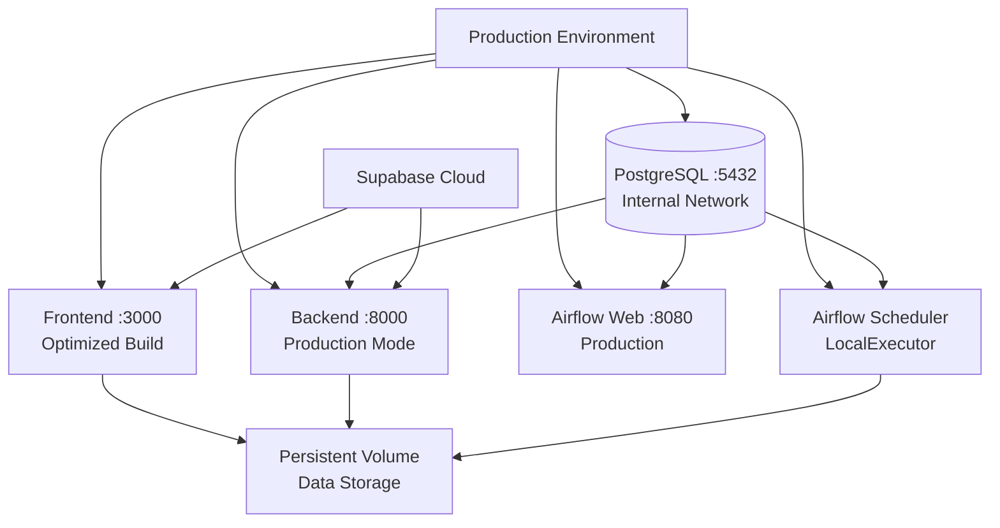

## Scalability Considerations

### Horizontal Scaling Points

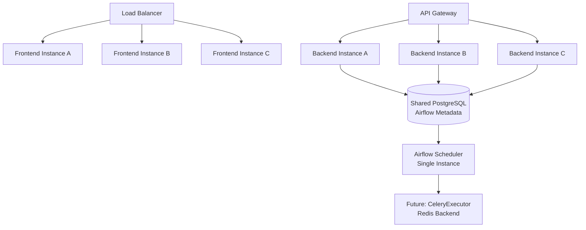

### Performance Optimizations

1. **Frontend**: Multiple Next.js instances with session affinity
2. **Backend**: FastAPI instances sharing PostgreSQL connection pool
3. **Airflow**: Upgrade path from LocalExecutor to CeleryExecutor for distributed processing
4. **Database**: Read replicas for analytics and reporting queries
5. **Caching**: Redis integration for session management and frequent queries

## Technology Stack Summary

| Layer | Technology | Version | Purpose |
|-------|-----------|---------|---------|
| Frontend | Next.js | 15.2.4 | React-based UI framework |
| UI Components | @dnd-kit, TailwindCSS | Latest | Drag-and-drop, styling |
| Backend | FastAPI | Latest | Python API framework |
| Orchestration | Apache Airflow | 2.10.4 | Workflow execution engine |
| Airflow Database | PostgreSQL | 15 | Airflow metadata storage |
| Application Database | Supabase PostgreSQL | Latest | User & workflow data |
| Authentication | Supabase Auth (GoTrue) | Latest | JWT-based authentication |
| Real-time | Supabase Realtime | Latest | WebSocket collaboration |
| Containerization | Docker Compose | Latest | Service orchestration |

## Key Architectural Benefits

1. **Clear Separation of Concerns**: Separate databases for Airflow metadata vs application data
2. **Modular Design**: Component-based task system allows easy extension
3. **Real-time Collaboration**: Live editing with presence awareness via Supabase Realtime
4. **User Isolation**: Multi-tenant architecture with proper separation
5. **Dynamic Workflow Generation**: Runtime DAG creation from visual configurations
6. **Development-friendly**: Hot reloading and debugging support
7. **Cloud-native Authentication**: Leverages Supabase for robust user management

## Future Architecture Considerations

1. **Message Queue**: Add Redis/RabbitMQ for async communication patterns
2. **Microservices**: Split backend into smaller, domain-focused services
3. **Distributed Execution**: Upgrade to CeleryExecutor with Redis backend for scalability
4. **Monitoring**: Add observability with Prometheus/Grafana integration
5. **Multi-region**: Database replication and geographic distribution
6. **API Gateway**: Implement proper API gateway for rate limiting and security